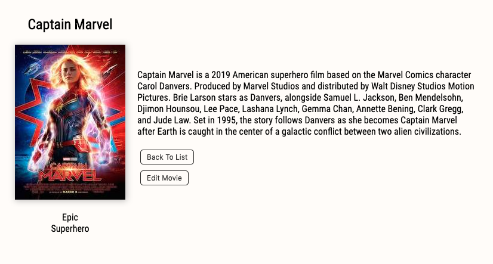

# Movie Database

## Description

This is a database template for any media related items. It uses a simple flexible grid system that allows the user to navigate the database with ease. Clicking on movie poster allows users to view details and genre listings about the movie. From this details page users are also able to edit the movie title and description which updates the database for all users.

## Technologies Used

- React
- React Redux
- Redux Sagas
- Javascript
- Node
- Express
- Axios
- HTML
- CSS

## Project Image

 

## Installation

- Download from GitHub
- Create the tables and insert the data in the databse.sql file
- npm install
- open your terminal
- npm run server
- cmd + t for a new terminal tab
- npm run client

## Contact

- Brooks Geenen
- brgeen@gmail.com

